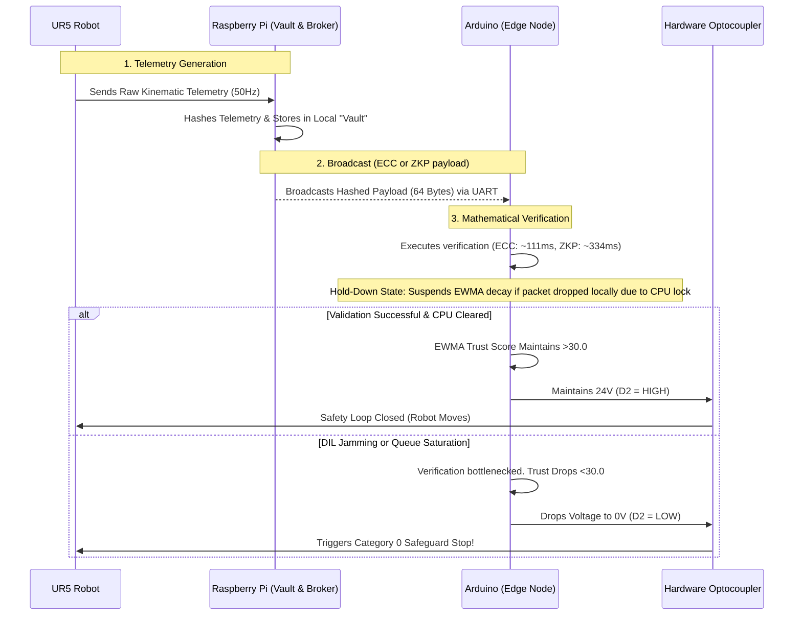

# System Architecture & Data Flow (V4 Integrated)

This document maps the final topological boundaries and data pathways of the proposed decentralized verification framework, integrating the Phase 4 Dual-Mesh cryptography and the 24V PNP hardware bypass.

## 1. Topographical Layout: Edge-Compute Star Mesh
The system bypasses microcontroller memory constraints by employing a Star-Compute Topology:
*   **Level 4 Cloud IdP**: Centralized Identity Provider for persistence and certificate leasing.
*   **Supervisor Node (Raspberry Pi 4)**: The "Vault". Runs ROS 2, executes the cryptographic hashing of raw 50Hz kinematic telemetry, and manages network connectivity.
*   **Worker Nodes (Arduino Nano 33 BLE)**: Bare-metal execution environment handling mathematical validation via a continuous Exponentially Weighted Moving Average (EWMA) Trust Score.
*   **Hardware Interface (24V PNP Optocoupler)**: The physical bridge bypassing the UR5's internal `URScript` software scheduler.

## 2. Core Data Flow (ZKP/ECC Dual-Mesh)

## 3. The 24V Hardware Bypass & Latching Fault
Software-level preemption (e.g., injecting a `stopl()` command via TCP/IP `URScript`) consumes over **368ms** in thread scheduling overhead, threatening the 500ms safety boundary.
To eliminate this, the decentralized edge-compute framework uses a bare-metal 24V intercept directly to the UR5 SCB:
*   **Dual-Channel Integration**: The Arduino drives two independent 24V inputs (SI0 and SI1).
*   **The Latching Fault**: If the EWMA score fluctuates, the micro-second discrepancy between restoring Channel 1 and Channel 2 forces the UR5 to trigger a **C192A4 Safeguard Stop Disagreement**. This enforces a manual human-in-the-loop reset, preventing a compromised system from spontaneously resuming kinetic motion.
