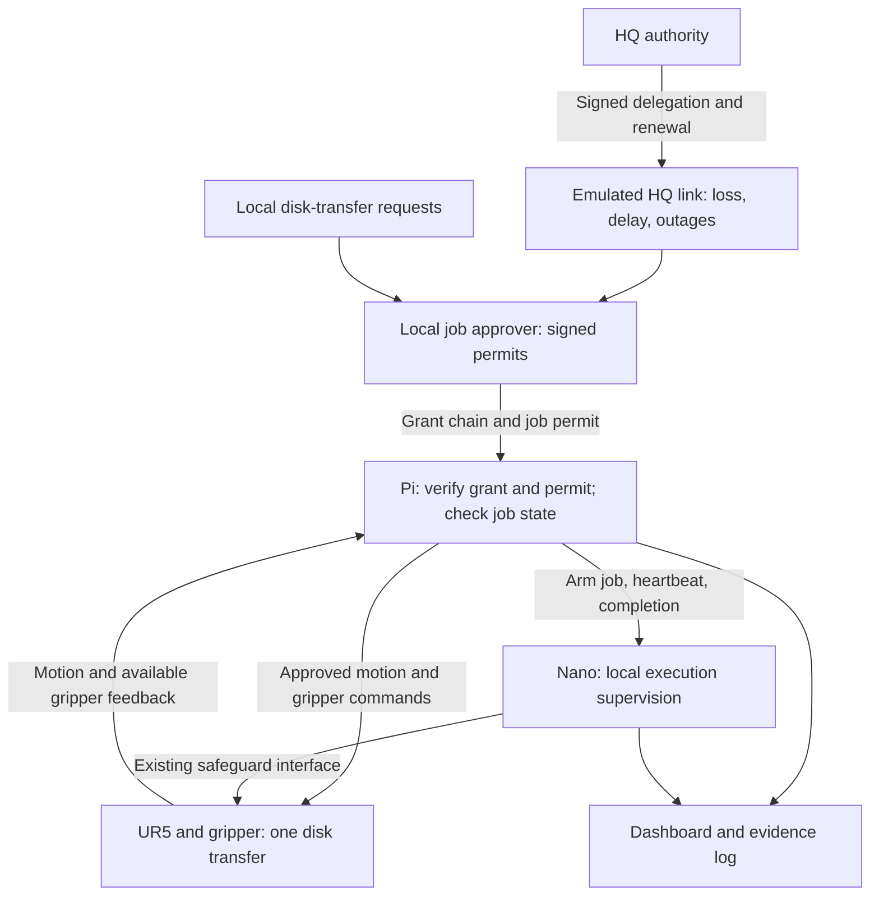

# Delegated robot-job authorization: proposed test plan

September 29, 2026. Planning artifact only, updated September 30 for Luke's scope correction. Luke has selected job approvals, one-object jobs, Pi verification, Nano retention, and admission-based expiry. One robot is a boundary; delegation depth is not fixed and remains to be justified. The diagram below is the simplest grant path, not a cap on delegation hops. Hanoi is a candidate retrofit. No hardware, firmware, or experiment configuration has been changed; no tests described here have been executed. Advisor acceptance and the final matrix remain pending.

## Concise research notes

**Motivation:** Robotic workcells in disconnected, intermittent, and limited environments need to continue useful work when central authorization services are unreachable. Local job approval could preserve operation while cryptographically defined limits constrain what the cell may authorize.

**Research problem:** A disconnected cell must determine which new jobs it may approve, reject forged or excessive permissions, and distinguish permission to start a job from permission to finish an admitted job. These decisions must remain consistent with physical task state, including retries and reconnection. The practical benefit of local delegation over central approval and pre-issued offline permissions needs experimental evaluation.

**Research question:** How does constrained cryptographic delegation affect authorized job completion and enforcement of task-admission rules in a robotic workcell under disconnected, intermittent, and limited connectivity, compared with central authorization and pre-issued offline permissions?

## Simple proposed architecture

The diagram depicts the delegation mode. The Pi's trusted HQ verification key is provisioned beforehand; it must not depend on a live HQ lookup. The local approver should have a separate key and preferably run on the operator laptop, with the Pi retaining the robot-control interface. For the central baseline the approver requests an HQ-signed job permit through the impaired link. For the offline-permission baseline the verifier uses previously issued scoped credentials. Local authorization traffic, robot control, and Nano supervision remain unimpaired in the main DIL block.

The approver and verifier are distinct security roles. Separate processes on a single compromised operating system would not provide protection against full host compromise. Neither an issuer nor a test client may bypass the verifier through a direct robot-control path in the evaluated configuration.

## Hanoi as the physical workload

Start with three disks if the apparatus and gripper permit; one disk transfer is one job. Keep a table of calibrated peg poses, approach/retract poses, disk dimensions, and stacking heights, plus a separate current stack-state array. A job identifies the robot, disk, source, destination, expected state version, unique job ID, start deadline, and allowed completion duration. The signature binds these fields.

The Pi checks both authorization and puzzle preconditions: the selected disk is on top, the destination placement is legal, and the expected state matches. A valid signature alone does not establish a legal move or physical task success. Different rejection reasons must be logged separately.

Commit the next stack state only after checked completion. Without disk-position sensing, use controlled initial placement and operator/video confirmation for physical results; controller success alone is not proof that a disk was transferred. An uncertain grasp or interrupted move requires reconciliation before another job. Retries after lost acknowledgements must not repeat a consumed or in-progress job; after a restart, uncertain jobs remain blocked pending reconciliation.

A known full solution is a useful control and can be completely preauthorized. A second workload can introduce a different legal local goal after disconnection. Give every architecture the same goal-change trace, and include a reusable scoped offline permission wherever the policy allows it. A broad cached permission may match delegation. Any gain achieved by granting more authority must be identified as a policy difference, not a protocol advantage.

## Block A: DIL pilot matrix

Run the following eight profiles against three authorization modes: central approval, pre-issued offline permissions, and local delegation. Five repeated episodes per cell give 120 automated bench episodes for one common workload trace. This is a pipeline/variability pilot, not a final sample-size claim. Use the real credential/verifier implementations and a clearly labeled robot simulator at home. Physical validation is a separate subset.

| ID | HQ-link profile | Main question |
| --- | --- | --- |
| C0 | No added impairment | Connected reference behavior |
| C1 | 5% independent packet loss | Mild loss and retry behavior |
| C2 | 15% independent packet loss | Intermediate loss |
| C3 | 30% independent packet loss | Severe random loss |
| C4 | One 30-second complete outage | Continuity during a short partition |
| C5 | One 120-second complete outage | Continuity and authority exhaustion during a longer partition |
| C6 | Repeating 10 seconds reachable / 20 seconds disconnected | Intermittent availability, renewal, and retry behavior |
| C7 | 128 kbit/s plus 200 ms added one-way delay | Combined limited-link condition |

These are proposed laboratory stress levels, not measured operational DIL distributions. In C1-C3 apply the stated loss probability separately in each HQ-link direction and record both. A 30% packet-drop setting is not a 30% application-request failure probability; transport retransmission and request timeouts affect the result. C7 is a combined scenario, not a separate causal estimate of bandwidth and delay effects.

Provision initial credentials before the impairment, then hold the root policy, start-validity rules, task-completion rules, job requests, and renewal/retry configuration constant where applicable. Include a schedule that crosses the admission deadline during disconnection; tune the exact episode length and issuance schedule in the timing pilot. Reuse request traces across modes and independent network seeds across repetitions; seeds do not guarantee identical losses for architectures generating different traffic. Counterbalance architecture order.

Record achieved loss and delay, application retries/timeouts, authority-renewal success, jobs requested/admitted/completed, reason-coded rejections, time waiting for authority, duplicate physical execution, and task-state divergence. Report simulator outcomes separately from physical outcomes. No crossover or superiority is presumed.

## Block B: permit and task-enforcement tests

| ID | Test | Expected behavior |
| --- | --- | --- |
| S0 | Valid fresh permit within grant and legal current puzzle state | Exactly one job admitted; completion recorded |
| S1 | Forged signature, unknown issuer, or altered signed disk/destination | Reject before motion; preserve an unrelated valid active job |
| S2 | Correctly signed local permit exceeds parent scope or start deadline | Reject independently of the local issuer's signature validity |
| S3 | Wrong robot/requester binding or wrong expected task state | Reject; distinguish credential failure from task-state failure |
| S4 | Replay consumed/in-progress job; repeat after lost response/reconnection | No second execution; return known status or require reconciliation |
| S5 | Permit or parent admission authority already expired at dispatch | Do not start, even if the job was previously queued |
| S6 | Admission deadline passes while a valid job is moving | Finish that bounded job; block the next job until valid authority exists |
| S7 | Signed, authorized request violates Hanoi move rules | Reject by task guard; do not call this a signature failure |
| S8 | Local Pi/Nano supervision is lost or a job overruns its execution allowance | Exercise the defined Nano safeguard response; separate this from HQ loss |

Exercise credential cases in software first, including connected and disconnected operation, because offline enforcement must not require an HQ lookup. S2 demonstrates containment of an issuer's excessive grant while the Pi verifier remains trusted; it does not demonstrate general detection of compromised nodes. A compromised issuer can still authorize jobs inside its granted rights. Full compromise of the verifier, HQ signing key theft, physical bypass, and volumetric denial of service are outside the proposed core.

Suggested physical pilot: six short scenarios (valid control, valid jobs during HQ loss, expiry during a move, forged/over-scoped request, replay, local-supervision fault), each repeated three times across scheduled lab sessions. The resulting 18 sequences are integration evidence, not final statistical validation. Only validated preprogrammed motions are used; invalid commands should never become robot trajectories. Choose the final physical sample after measuring move duration, reset effort, and variability.

## Interpretation limits and next decisions

- Cryptographic authenticity, delegated scope, admission validity, puzzle legality, and observed placement are separate checks.
- The Nano relies on Pi-provided admission/completion information. It supplies local supervision and the safeguard output, not independent cryptographic verification or certified safety.
- Admission expiry allows bounded completion only because that policy is authorized in the parent grant; it does not grant indefinite continuation.
- The task solver and authorization policy are distinct. Improving a Hanoi solver is not the contribution.
- Next specify the gripper interface, disk geometry, approved locations, completion evidence, root grant limits, and actual hosting of the local issuer. Then run a bench feasibility check before finalizing the matrix.

Sources: [Linux netem manual](https://man7.org/linux/man-pages/man8/tc-netem.8.html) for impairment mechanisms; [ACE-OAuth token validation](https://www.rfc-editor.org/rfc/rfc9200.html#section-5.10.1.1) for authorization-validation building blocks. These are references, not claims that this proposed system implements an ACE profile or that its research novelty is established.
