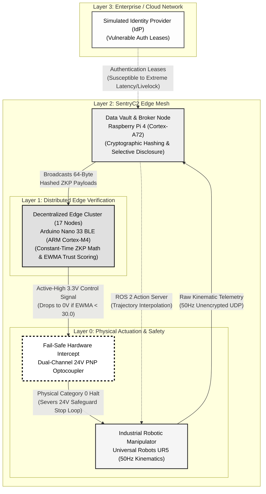

```mermaid
graph TD
    subgraph "Layer 3: Enterprise / Cloud Network"
        IdP["Simulated Identity Provider (IdP)<br/>(Vulnerable Auth Leases)"]
    end

    subgraph "Layer 2: SentryC2 Edge Mesh"
        Pi["Data Vault & Broker Node<br/>Raspberry Pi 4 (Cortex-A72)<br/>(Cryptographic Hashing & Selective Disclosure)"]
      
        subgraph "Layer 1: Distributed Edge Verification"
            Arduino["Decentralized Edge Cluster (17 Nodes)<br/>Arduino Nano 33 BLE (ARM Cortex-M4)<br/>(Constant-Time ZKP Math & EWMA Trust Scoring)"]
        end
      
        subgraph "Layer 0: Physical Actuation & Safety"
            Relay["Fail-Safe Hardware Intercept<br/>Dual-Channel 24V PNP Optocoupler"]
            UR5["Industrial Robotic Manipulator<br/>Universal Robots UR5 (50Hz Kinematics)"]
        end
    end

    %% Telemetry Flow
    UR5 -- "Raw Kinematic Telemetry<br/>(50Hz Unencrypted UDP)" --> Pi
    Pi -- "Broadcasts 64-Byte<br/>Hashed ZKP Payloads" --> Arduino
    
    %% Hardware Safety Loop
    Arduino -- "Active-High 3.3V Control Signal<br/>(Drops to 0V if EWMA < 30.0)" --> Relay
    Relay -- "Physical Category 0 Halt<br/>(Severs 24V Safeguard Stop Loop)" --> UR5
    
    %% Auxiliary Connections
    IdP -. "Authentication Leases<br/>(Susceptible to Extreme Latency/Livelock)" .-> Pi
    Pi -. "ROS 2 Action Server<br/>(Trajectory Interpolation)" .-> UR5

    %% Academic Grayscale Styling for Print
    classDef cloud fill:#fdfdfd,stroke:#555555,stroke-width:2px,color:#000000;
    classDef pi fill:#efefef,stroke:#333333,stroke-width:2px,color:#000000;
    classDef edge fill:#e0e0e0,stroke:#111111,stroke-width:2px,color:#000000;
    classDef physical fill:#f5f5f5,stroke:#222222,stroke-width:2px,color:#000000;
    classDef relay fill:#ffffff,stroke:#000000,stroke-width:3px,stroke-dasharray: 5 5,color:#000000;

    class IdP cloud;
    class Pi pi;
    class Arduino edge;
    class UR5 physical;
    class Relay relay;
```
