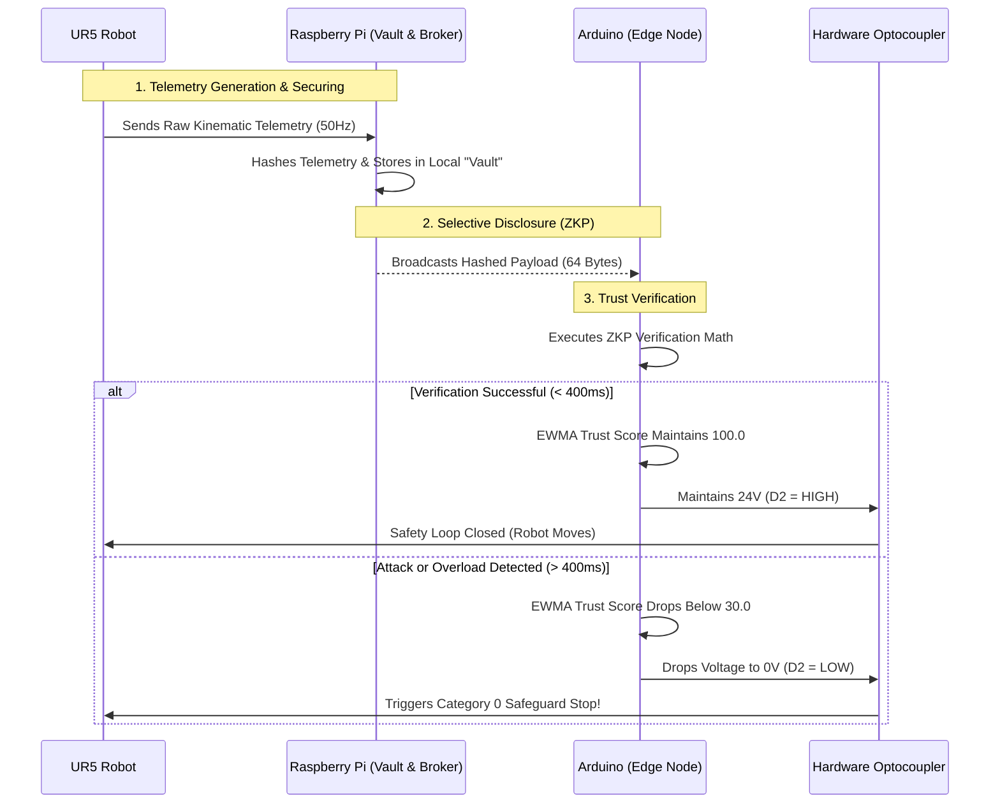

# System Architecture & Data Flow

This document provides a fundamental, step-by-step breakdown of how data moves through the cryptographic framework, from the robot's physical movement to the hardware E-Stop. 

## 1. The Core Data Flow (Mermaid Diagram)

The following diagram illustrates the exact lifecycle of a single robotic movement command.

---

## 2. Fundamental Understanding: Step-by-Step

### Step 1: The Robot and The Vault
Industrial robots are dumb. The **UR5** generates raw, unencrypted physical telemetry (like "Joint 1 is at 90 degrees") 50 times per second (50Hz). 
If we just blast this unencrypted data over a factory WiFi network, a hacker can easily read it or alter it. To prevent this, the **Raspberry Pi** intercepts the raw data and acts as a secure "Vault". It hashes the data (scrambling it into a secure cryptographic string) and securely stores the raw data internally. 

### Step 2: The Zero-Knowledge Proof (ZKP)
Instead of sending the raw data over the network, the Pi broadcasts the 64-Byte **Hashed Payload** to the edge nodes (your Arduinos). 
This is where the magic of the **Zero-Knowledge Proof (ZKP)** happens. The Arduino runs advanced mathematics on the hash to verify that the telemetry came from a legitimate source and hasn't been tampered with, *without ever actually seeing the raw joint angles*. (Hence, "Zero Knowledge").

### Step 3: The EWMA Trust Score
Every time the Arduino verifies a payload, it times exactly how long the math took. Under normal conditions, the Cortex-M4 chip completes the 64B verification in `325ms`. 
We use an **Exponentially Weighted Moving Average (EWMA)** to track the health of the node. 
* If a hacker floods the network (a Denial of Service attack), the Arduino's processor gets bogged down, and the verification takes longer than `400ms`. 
* When this happens, the EWMA algorithm mathematically bleeds the "Trust Score" down from `100.0`.

### Step 4: The Hardware Bypass
Software alerts are useless if a robot is about to swing into a human. If the Arduino's Trust Score plunges below `30.0`, it assumes the network is critically compromised. 
The Arduino immediately cuts the 3.3V signal to the **24V PNP Optocoupler**. This acts as a physical kill-switch, severing the 24V supply to the UR5's `SI0/SI1` safety ports. The robot instantly snaps into a rigid **Category 0 Safeguard Stop**, prioritizing human safety above all else.
