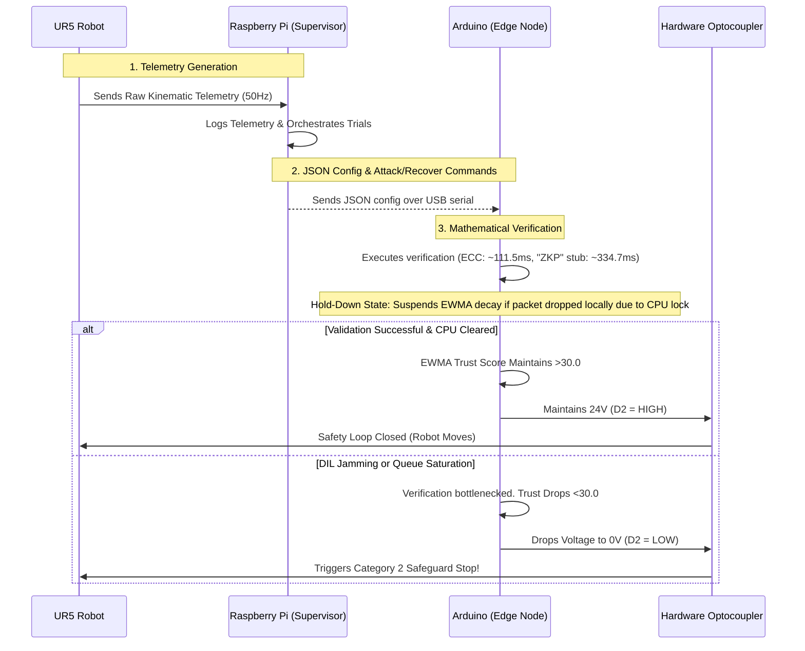

# System Architecture & Data Flow (V4 Integrated)

This document maps the final topological boundaries and data pathways of the proposed decentralized verification framework, integrating the Phase 4 dual-path (ZKP/ECC) cryptography and the 24V PNP hardware bypass.

## 1. Topographical Layout: Edge-Compute Star Topology (USB-Serial)
The system bypasses microcontroller memory constraints by employing a Star-Compute Topology:
*   **Level 4 Cloud IdP**: Centralized Identity Provider for persistence and certificate leasing.
*   **Supervisor Node (Raspberry Pi 4)**: Supervisor/orchestrator. Runs ROS 2 and the campaign scripts, probes cloud viability, sends configuration and attack/recover commands to the Arduinos over USB serial, and logs telemetry. (It is not a cryptographic "Vault" and does not hash the 50Hz kinematic stream — verification runs on the Arduinos.)
*   **Worker Nodes (Arduino Nano 33 BLE)**: Bare-metal execution environment handling mathematical validation via a continuous Exponentially Weighted Moving Average (EWMA) Trust Score.
*   **Hardware Interface (24V PNP Optocoupler)**: The physical bridge bypassing the UR5's internal `URScript` software scheduler.

## 2. Core Data Flow (ZKP/ECC Dual-Path)

```mermaid
sequenceDiagram
    participant UR5 as UR5 Robot
    participant PI as Raspberry Pi (Supervisor)
    participant EDGE as Arduino (Edge Node)
    participant SAFETY as Hardware Optocoupler
    
    %% Step 1: Telemetry Generation
    Note over UR5,PI: 1. Telemetry Generation
    UR5->>PI: Sends Raw Kinematic Telemetry (50Hz)
    PI->>PI: Logs Telemetry & Orchestrates Trials
    
    %% Step 2: Configuration & Commands
    Note over PI,EDGE: 2. JSON Config & Attack/Recover Commands
    PI-->>EDGE: Sends JSON config over USB serial
    
    %% Step 3: Edge Processing
    Note over EDGE: 3. Mathematical Verification
    EDGE->>EDGE: Executes verification (ECC: ~111.5ms, "ZKP" stub: ~334.7ms)
    Note over EDGE: Hold-Down State: Suspends EWMA decay if packet dropped locally due to CPU lock
    
    alt Validation Successful & CPU Cleared
        EDGE->>EDGE: EWMA Trust Score Maintains >30.0
        EDGE->>SAFETY: Maintains 24V (D2 = HIGH)
        SAFETY->>UR5: Safety Loop Closed (Robot Moves)
    else DIL Jamming or Queue Saturation
        EDGE->>EDGE: Verification bottlenecked. Trust Drops <30.0
        EDGE->>SAFETY: Drops Voltage to 0V (D2 = LOW)
        SAFETY->>UR5: Triggers Category 2 Safeguard Stop!
    end
```

**Notes on the diagram:**
*   The "ZKP" cycle time exercised in the trial campaigns was a **stub** (three ECC keypair generations, ~334.7ms), not real ZKP. Real ZKP has since been profiled at 224.86ms (sd 0.21, 300 runs) on the same hardware.
*   The Hold-Down suspension is currently **unbounded** — an adversary who saturates the CPU can hold decay suspended indefinitely. This is a known denial-of-safety gap, documented in `gaps.md` §5, not a validated safety feature.
*   The SI0/SI1 safeguard inputs produce a **Category 2** stop that auto-resumes on signal restoration; Category 0 requires the EI0/EI1 emergency inputs or cutting power to the safety relays. The one Category 0 behavior the system exhibits is the *fault path*: a latched C192A4 disagreement fault puts the controller in a safety-fault state that performs a Category 0 halt until manual reset (`ground_truth.md` §5.3).

## 3. The 24V Hardware Bypass & Latching Fault
Software-level preemption (e.g., injecting a `stopl()` command via TCP/IP `URScript`) consumes over **368ms** in thread scheduling overhead, threatening the self-imposed 500ms stop budget.
To eliminate this, the decentralized edge-compute framework uses a bare-metal 24V intercept directly to the UR5 SCB:
*   **Dual-Channel Integration**: The Arduino drives two independent 24V inputs (SI0 and SI1), producing a Category 2 safeguard stop that auto-resumes on signal restoration.
*   **The Latching Fault**: If the EWMA score fluctuates, the micro-second discrepancy between restoring Channel 1 and Channel 2 forces the UR5 to trigger a **C192A4 Safeguard Stop Disagreement**. This is a genuinely observed *timing fault on restoration* — not a designed latching stop — and once latched the controller's safety-fault state performs a **Category 0 halt** until manual reset. In practice it enforces a human-in-the-loop reset, preventing a compromised system from spontaneously resuming kinetic motion.
